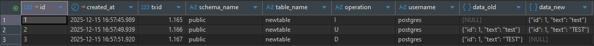

# 🐘 postgres-audit-log

[](https://opensource.org/licenses/MIT) [](https://www.postgresql.org/) [](https://www.postgresql.org/docs/current/plpgsql.html) [](https://www.postgresql.org/) [](https://github.com/richwrd/postgres-audit-log/stargazers)

> Lightweight PostgreSQL DML audit solution with automatic trigger management and partition support

<p align="center">
    
    
</p>

**postgres-audit-log** is a simple and extensible audit solution for PostgreSQL databases, focused on tracking DML operations (INSERT, UPDATE, DELETE) with high flexibility and granular per-schema control.

Designed for developers, DBAs, and infrastructure teams who need reliable traceability of database changes without external dependencies.

## 🎯 Why postgres-audit-log?

Unlike heavyweight audit solutions that require external tools or complex setups, **postgres-audit-log** provides:

- ✅ **Zero dependencies** - Pure PL/pgSQL implementation
- ✅ **Minimal overhead** - Optimized trigger functions with partition support
- ✅ **Easy deployment** - Single SQL file installation
- ✅ **Flexible configuration** - Control auditing at schema and operation level
- ✅ **Developer friendly** - JSONB format for easy querying and integration

## ✨ Features

| Feature                 | Description                                                                 |
| ----------------------- | --------------------------------------------------------------------------- |
| 📌 **Granular Control** | Enable/disable audit per schema and operation type (INSERT, UPDATE, DELETE) |
| 🗂️ **Structured Logs**  | JSONB format with complete before/after data snapshots                      |
| 🔄 **Auto Management**  | Dynamic trigger creation/removal via `audit.apply_rules()`                  |
| 📊 **Partitioning**     | Monthly partitions with automatic management                                |
| 🔒 **Data Integrity**   | Automatic validation and consistency checks                                 |
| 🐘 **Pure PostgreSQL**  | No external extensions or dependencies required                             |
| 🚀 **Production Ready** | Lightweight and battle-tested                                               |
| 🔍 **Rich Metadata**    | Captures username, timestamp, transaction ID, and operation context         |

## 🚀 Quick Start

```bash
# 1️⃣ Clone and install
git clone https://github.com/richwrd/postgres-audit-log.git
psql -U your_user -d your_database -f ./src/setup.sql

# 2️⃣ Create partitions
psql -d your_database -c "SELECT audit.auto_manage_partitions();"

# 3️⃣ Enable auditing
psql -d your_database -c "
    INSERT INTO audit.log_control (schema_name, log_insert, log_update, log_delete)
    VALUES ('public', TRUE, TRUE, TRUE);
    SELECT audit.apply_rules();"
```

See the [Quick Start Guide](docs/quick-start.md) for detailed instructions.

## 📚 Documentation

- **[Quick Start](docs/quick-start.md)** - Get up and running in minutes
- **[How It Works](docs/how-it-works.md)** - Understand the architecture and components
- **[Usage Examples](docs/usage-examples.md)** - Common queries and advanced use cases

## 🛠️ Requirements

- **PostgreSQL** 12+ (only tested on version 17 and above)
- **Superuser privileges** (for trigger creation and schema management)

## 📊 Structure Overview

```
postgres-audit-log/
├── src/
│   ├── setup.sql                   # Main installation file
│   ├── 1-schema/
│   │   ├── 1.1-tables.sql          # Creates audit tables
│   │   └── 1.2-triggers.sql        # Trigger management
│   └── 2-core/
│       ├── 2.1-record_change.sql   # Core logging function
│       ├── 2.2-apply_rules.sql     # Schema validation
│       └── 2.3-partitions.sql      # Partition helpers
└── docs/
    ├── quick-start.md
    ├── how-it-works.md
    ├── usage-examples.md
```

## 🌟 Show your support

Give a ⭐️ if this project helped you!

## 🤝 Contributing

Contributions are welcome! Feel free to:

1. Fork the project
2. Create a feature branch (`git checkout -b feature/AmazingFeature`)
3. Commit your changes (`git commit -m 'Add some AmazingFeature'`)
4. Push to the branch (`git push origin feature/AmazingFeature`)
5. Open a Pull Request

## 📚 My Related Projects

- [postgres-ha-cluster-lab](https://github.com/richwrd/postgres-ha-cluster-lab) - PostgreSQL High Availability Cluster with Patroni

## 📝 License

This project is licensed under the MIT License - see the [LICENSE](LICENSE) file for details.

<div align="center">

## 👤 Author

**Eduardo Richard** (richwrd)

[](https://github.com/richwrd)
[](https://www.linkedin.com/in/eduardorichard/)
[](https://www.buymeacoffee.com/richwrd)

</div>

<div align="center">

**Built with ❤️ for the PostgreSQL community**

</div>
