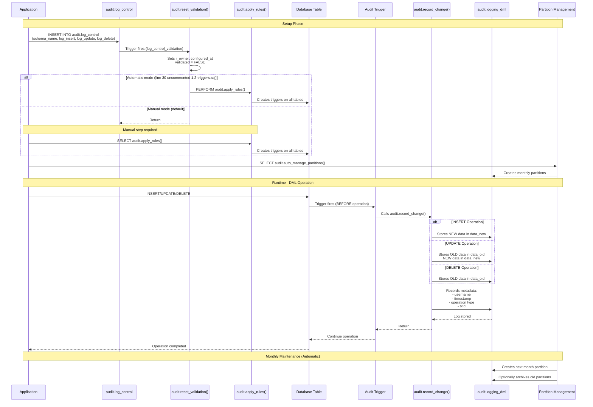

# 🏗️ How It Works

The solution consists of three main components:

## 1. [`audit.log_control`](../src/1-schema/1.1-tables.sql)

Control table that defines which schemas should be audited.

This table acts as the configuration center for the audit system. Each row represents a schema that can be monitored.

## 2. [`audit.logging_dml`](../src/1-schema/1.1-tables.sql)

Log table where all DML events are stored in JSONB format.

This table captures every INSERT, UPDATE, and DELETE operation performed on the monitored tables. Each log entry includes metadata such as the operation type, timestamp, user, and before/after data snapshots.

## 3. [`audit.apply_rules()`](../src/2-core/2.2-apply_rules.sql)

Main function that automatically creates/removes triggers based on `log_control`:

```sql
SELECT audit.apply_rules();
```

### What This Function Does

1. **Scans** all schemas marked as `active = true` in `audit.log_control`
2. **Creates** audit triggers on all tables in those schemas
3. **Removes** triggers from tables in schemas marked as `active = false` or removed from control
4. **Returns** a report of actions taken

### Trigger Behavior

Each table gets three triggers automatically created:

- `audit_dml_trigger`: Captures INSERT operations
- `audit_dml_trigger`: Captures UPDATE operations
- `audit_dml_trigger`: Captures DELETE operations

These triggers are invisible to your application and execute before the DML operation completes.

## Sequence Diagram


